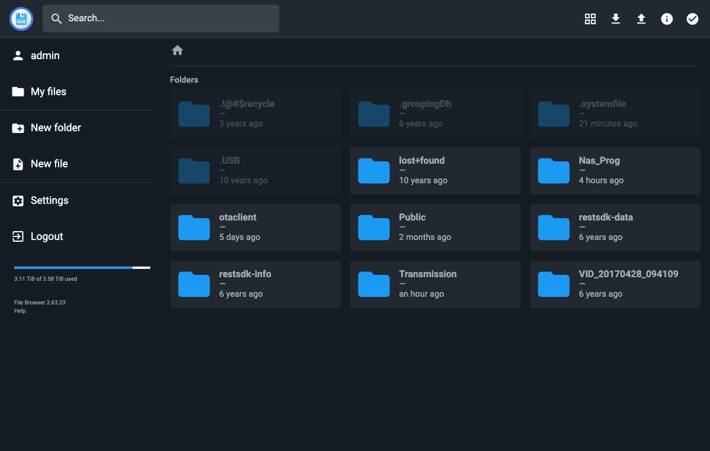
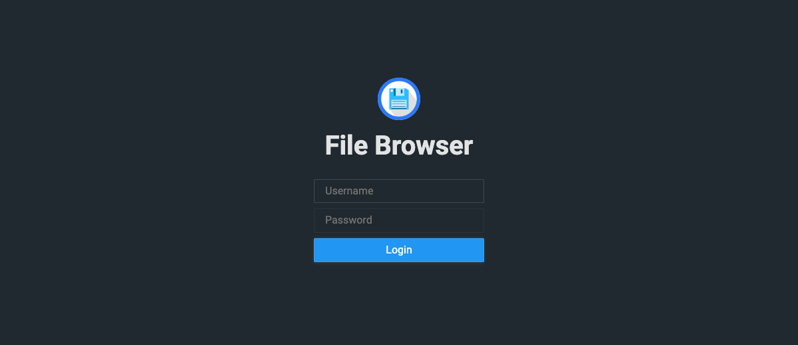

<h1 align="center">WD FileBrowser App</h1>

<p align="center">
  A fast, self-hosted web file manager for the WD My Cloud NAS —
  installed as a headless, auto-starting service over SSH.
</p>

<p align="center">
  
</p>

---

## What this is

[File Browser](https://filebrowser.org) is a single-binary web app for browsing,
uploading, moving, and managing files. This project runs it directly on a **WD My
Cloud EX2 Ultra (OS 5, ARM)** so you can manage the NAS from any browser on your
network — far quicker than the stock dashboard or a mounted network share.

It runs as a background service supervised by `monit`, so it **starts at boot** and
**restarts on crash**, with no dependency on the WD app store.

- **Access:** http://192.168.0.103:8088
- **Login:** username `admin` (password set separately — see [Change the login password](#change-the-login-password))
- **Tested on:** firmware `5.33.102`, `armv7l`

<p align="center">
  
</p>

## Why not a dashboard tile?

OS 5's `apkg` daemon rebuilds the dashboard app list from a **signature-verified**
store, so a manually added entry is dropped on the next rebuild. A real tile would
need a WD-signed package (WD holds the private key — not public, not forged here) or
disabling the firmware's signature check, which is a genuine security downgrade. So
this ships as a headless service plus a bookmarkable URL. Tile work is tracked in
[TODO.md](TODO.md).

## How it works

- The `filebrowser` binary runs from `/mnt/HD/HD_a2/Nas_Prog/filebrowser/`, bound to
  `0.0.0.0:8088`, with its data in `fb.db` — all on the data volume, which survives
  firmware updates.
- `monit` (`/etc/monit/conf-enabled/filebrowser`) supervises it for boot-start and
  crash-restart — the same mechanism WD uses for Plex.
- The WD app scaffold (`apkg.xml`, hooks, icon) is kept for possible future tile
  integration, but `monit` is what keeps the service alive today.

## Repository layout

| Path | Purpose |
|------|---------|
| `app/install.sh` | Idempotent installer — deploys files, fetches the binary, wires `monit` |
| `app/start.sh` / `stop.sh` | Service start/stop hooks (bind `0.0.0.0:8088`) |
| `app/init.sh` / `clean.sh` | Install / post-remove hooks (no-ops) |
| `app/remove.sh` | Uninstall hook — stops app, removes `monit` watch, drops registry entry |
| `app/apkg.xml` / `apkg.rc` | WD app manifest + metadata (for future tile use) |
| `app/filebrowser.png` | Tile icon |
| `app/monit.filebrowser.conf` | `monit` watch definition |
| `docs/` | Screenshots |

The 34 MB `filebrowser` binary, `fb.db`, and logs are not tracked; the installer
fetches the binary.

## Install (on the NAS, over SSH)

```bash
NAS=sshd@192.168.0.103        # your NAS SSH user@ip
scp -r app "$NAS":/tmp/fb-app
ssh "$NAS" 'sh /tmp/fb-app/install.sh'
```

## Change the login password

`fb.db` is single-writer, so stop the running server first (and stop `monit` from
respawning it mid-edit).

**Web UI (easiest, no downtime):** log in → **Settings → User Management** → edit the
user → set a new password → Save.

**CLI over SSH:**

```bash
ssh sshd@192.168.0.103 'D=/mnt/HD/HD_a2/Nas_Prog/filebrowser
monit unmonitor filebrowser
sh "$D/stop.sh" "$D"
"$D/filebrowser" users ls -d "$D/fb.db"                       # list usernames
"$D/filebrowser" users update admin --password "NEW_PASSWORD" -d "$D/fb.db"
monit monitor filebrowser'                                    # restarts the server
```

> **Note:** File Browser enforces a password strength check. The minimum length has
> been lowered to 5 on this install, but trivial passwords (e.g. `admin`) are still
> rejected as "too easy".

## Debugging

All commands run over SSH: `ssh sshd@192.168.0.103`. App dir: `/mnt/HD/HD_a2/Nas_Prog/filebrowser`.

| Symptom | Check |
|---------|-------|
| Can't reach `:8088` | `pgrep -f "filebrowser -d"` — is it running? |
| Is it on the LAN? | `netstat -ltnp \| grep 8088` — expect `:::8088` (not `127.0.0.1`) |
| monit health | `monit status filebrowser` — expect `status OK`, `Monitored` |
| Startup / runtime errors | `tail -50 /mnt/HD/HD_a2/Nas_Prog/filebrowser/fb.log` |
| Didn't start at boot | `monit summary \| grep filebrowser`; `cat /etc/monit/conf-enabled/filebrowser` |
| Manual restart | `monit restart filebrowser` |
| Port already in use | `netstat -ltnp \| grep 8088`, `kill` the stale PID, `monit restart filebrowser` |
| DB locked | stop the server before any `filebrowser` CLI call — a process still holds `fb.db` |

Common gotchas:
- `start.sh` / `stop.sh` take the app dir as `$1` — run as
  `sh start.sh /mnt/HD/HD_a2/Nas_Prog/filebrowser`.
- A firmware **update** (not a normal reboot) can wipe the `monit` conf — re-run
  `install.sh`. The app dir on the data volume survives.
- If `monit` keeps reviving a broken instance, `monit unmonitor filebrowser` while you
  investigate, then `monit monitor filebrowser` when done.

## Caveats

- **LAN exposure:** filebrowser binds `0.0.0.0:8088` so it's reachable across the LAN
  (it has its own login). To restrict to localhost + SSH tunnel, change the bind in
  `start.sh` back to `127.0.0.1` and reach it via
  `ssh -N -L 8088:127.0.0.1:8088 sshd@192.168.0.103`.
- **Firmware updates** can wipe the `monit` conf (it lives on the firmware partition).
  Re-run `install.sh` afterward.
